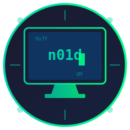

# n01d Machine

<p align="center">
  
</p>

<p align="center">
  <strong>🔒 Secure Cross-Platform Virtual Machine Manager</strong><br>
  <em>Sandboxing • Tor • VPN • Network Isolation</em>
</p>

<p align="center">
  <a href="#features">Features</a> •
  <a href="#security">Security</a> •
  <a href="#download">Download</a> •
  <a href="#installation">Installation</a> •
  <a href="#usage">Usage</a> •
  <a href="#building">Building</a>
</p>

<p align="center">
  
  
  
</p>

---

## Features

### 🖥️ Virtual Machine Management
- **Create & Manage VMs** - Easy VM creation with customizable RAM, CPUs, and disk size
- **ISO Management** - Browse and quick-boot ISO images
- **Quick Boot** - Instantly boot any ISO without creating a VM
- **Hardware Acceleration** - KVM (Linux), HVF (macOS), WHPX (Windows)

### 🔒 Security Features (NEW in v1.1.0)
- **Security Profiles** - Pre-configured profiles for different threat models
- **Network Isolation** - Multiple isolation modes for secure VM networking
- **Tor Integration** - Route all VM traffic through Tor network
- **VPN Support** - WireGuard and OpenVPN with kill switch
- **Sandboxing** - QEMU sandbox mode for each VM
- **Firewall Rules** - Auto-generated based on security profile

### 🎨 User Interface
- **Modern Dark UI** - Beautiful cyberpunk-inspired interface
- **Security Center** - Manage security profiles and Tor/VPN status
- **Network Configuration** - Configure VPN, Tor, and isolation settings
- **Cross-Platform** - Native apps for Linux, Windows, and macOS

---

## Security

### 🛡️ Security Profiles

| Profile | Description | Use Case |
|---------|-------------|----------|
| 🔴 **Paranoid** | Full isolation, Tor routing, no host access | Maximum anonymity, sensitive research |
| �� **Stealth** | VPN + Tor chain, kill switch enabled | Anonymous browsing, journalism |
| 🟡 **Isolated** | Complete network isolation, air-gapped | Malware analysis, offline work |
| 🟢 **Pentesting** | Internal network, tools access | Security testing, CTF |

### 🌐 Network Isolation Modes

| Mode | Description |
|------|-------------|
| **Full** | No network access - completely air-gapped |
| **Host Only** | Access only to host machine |
| **Internal** | VMs can communicate with each other only |
| **Tor Only** | All traffic routed through Tor |
| **VPN Only** | All traffic through VPN tunnel |

### 🧅 Tor Integration
- SOCKS proxy routing (port 9050)
- Bridge support for censored networks
- One-click identity rotation
- Exit node selection
- DNS leak protection

### 🔐 VPN Features
- WireGuard support (recommended)
- OpenVPN support
- Kill switch - blocks traffic if VPN disconnects
- DNS leak protection
- Custom server configuration

---

## Download

### Latest Release (v1.1.0)

| Platform | Download |
|----------|----------|
| �� Linux (AppImage) | [n01d-machine_1.1.0_amd64.AppImage](https://github.com/bad-antics/n01d-machine/releases/latest) |
| 🐧 Linux (Debian) | [n01d-machine_1.1.0_amd64.deb](https://github.com/bad-antics/n01d-machine/releases/latest) |
| 🪟 Windows (Installer) | [n01d-machine_1.1.0_x64-setup.exe](https://github.com/bad-antics/n01d-machine/releases/latest) |
| 🪟 Windows (MSI) | [n01d-machine_1.1.0_x64.msi](https://github.com/bad-antics/n01d-machine/releases/latest) |
| 🍎 macOS (DMG) | [n01d-machine_1.1.0_x64.dmg](https://github.com/bad-antics/n01d-machine/releases/latest) |

---

## Prerequisites

### Required: QEMU

#### Linux
```bash
# Debian/Ubuntu
sudo apt install qemu-system-x86 qemu-utils

# Fedora
sudo dnf install qemu-system-x86 qemu-img

# Arch
sudo pacman -S qemu-full
```

#### Windows
```powershell
# Via Chocolatey
choco install qemu

# Or download from https://qemu.weilnetz.de/w64/
```

#### macOS
```bash
brew install qemu
```

### Optional: Security Tools

#### Tor (for Tor routing)
```bash
# Linux
sudo apt install tor

# macOS
brew install tor

# Windows: Download Tor Expert Bundle
```

#### WireGuard (for VPN)
```bash
# Linux
sudo apt install wireguard

# macOS
brew install wireguard-tools

# Windows: Download from wireguard.com
```

---

## Installation

### Linux AppImage
```bash
chmod +x n01d-machine_1.1.0_amd64.AppImage
./n01d-machine_1.1.0_amd64.AppImage
```

### Linux Debian Package
```bash
sudo dpkg -i n01d-machine_1.1.0_amd64.deb
```

### Windows
Run the installer (`.exe` or `.msi`) and follow the prompts.

### macOS
Open the DMG and drag n01d Machine to your Applications folder.

---

## Usage

### Creating a Secure VM

1. Click **"Create VM"** in the sidebar
2. Enter VM name and select an ISO
3. Configure RAM, CPUs, and disk size
4. **Select a Security Profile** (Paranoid, Stealth, Isolated, or Pentesting)
5. Click **"Create Secure VM"**

### Running with Security

- **▶ Run** - Normal boot from disk
- **💿 Live** - Boot from ISO (live mode)
- **🔒 Secure** - Launch with security profile selection

### Security Center

Access the **Security** tab to:
- View and manage security profiles
- Toggle Tor service on/off
- Request new Tor identity
- Monitor active protections

### Network Configuration

Access the **Network** tab to:
- Configure network isolation mode
- Set up VPN (WireGuard/OpenVPN)
- Configure Tor settings (bridges, exit nodes)
- Enable kill switch and DNS protection

### File Locations

| Path | Description |
|------|-------------|
| `~/n01d-machine/vms/` | Virtual machine disks |
| `~/n01d-machine/isos/` | ISO images |
| `~/n01d-machine/security/` | Security profiles |
| `~/n01d-machine/vpn/` | VPN configurations |
| `~/n01d-machine/tor/` | Tor configurations |
| `~/n01d-machine/config.json` | Main config file |

---

## Building from Source

### Prerequisites
- Rust 1.70+
- Node.js 18+
- Platform-specific dependencies

### Linux
```bash
# Install dependencies
sudo apt install libgtk-3-dev libwebkit2gtk-4.0-dev libappindicator3-dev librsvg2-dev

# Build
cd releases/n01d-cross-platform
cargo install tauri-cli
cargo tauri build
```

### Windows
```powershell
cd releases\n01d-cross-platform
cargo install tauri-cli
cargo tauri build
```

### macOS
```bash
cd releases/n01d-cross-platform
cargo install tauri-cli
cargo tauri build
```

---

## Project Structure

```
n01d-machine/
├── n01d                       # CLI application (Python)
├── n01d-gui                   # GTK GUI (Python, Linux only)
├── n01d-icon.svg              # Application icon
├── n01d-machine.desktop       # Linux desktop entry
├── releases/
│   └── n01d-cross-platform/   # Tauri cross-platform build
│       ├── public/            # Web UI
│       └── src-tauri/
│           ├── src/
│           │   ├── main.rs    # Rust backend
│           │   └── security.rs # Security module
│           └── Cargo.toml
└── .github/
    ├── workflows/
    │   └── release.yml        # CI/CD
    └── ISSUE_TEMPLATE/        # Bug/Feature templates
```

---

## Changelog

### v1.1.0 (2026-02-01)
- ✨ Added security profiles (Paranoid, Stealth, Isolated, Pentesting)
- ✨ Added network isolation modes
- ✨ Added Tor integration with bridge support
- ✨ Added VPN support (WireGuard, OpenVPN)
- ✨ Added kill switch and DNS leak protection
- ✨ Added Security Center UI
- ✨ Added Network Configuration UI
- 🐛 Fixed GitHub Actions workflow

### v1.0.0 (2026-02-01)
- 🎉 Initial release
- VM creation, management, and deletion
- ISO browsing and quick boot
- Cross-platform support (Linux, Windows, macOS)

---

## Contributing

Contributions are welcome! Please feel free to submit a Pull Request.

See our [issue templates](.github/ISSUE_TEMPLATE) for bug reports and feature requests.

---

## License

MIT License - see [LICENSE](LICENSE)

---

<p align="center">
  Made with ❤️ by <a href="https://github.com/bad-antics">NullSec Team</a>
</p>

<p align="center">
  <sub>🔒 Privacy is not a crime</sub>
</p>
